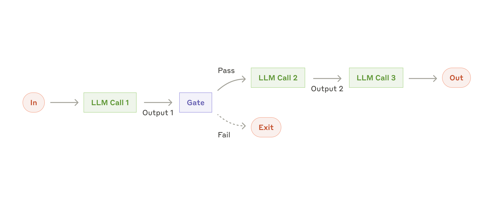
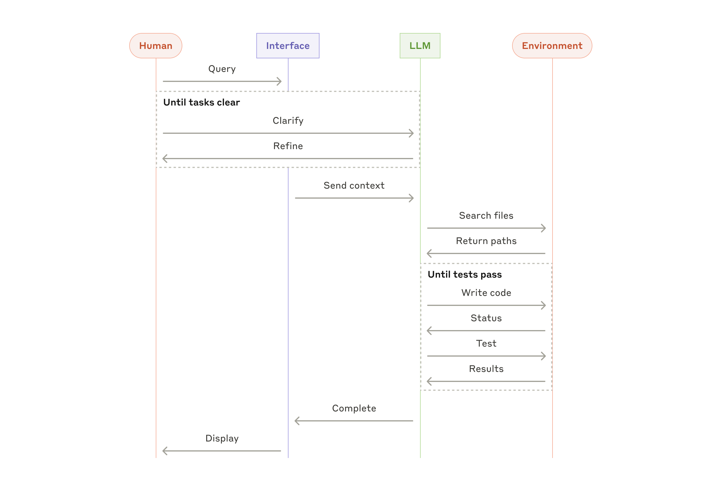

> 📄 **原文信息**
>
> - **标题**: Building effective agents
> - **作者**: Erik S. 和 Barry Zhang（Anthropic）
> - **发布日期**: 2024年12月19日
> - **原文链接**: [https://www.anthropic.com/engineering/building-effective-agents](https://www.anthropic.com/engineering/building-effective-agents)
>
> *本文为中文翻译版本，由 Claude Code 翻译。所有图片均已下载至本地并重新引用。*

---

在过去的一年里，我们与数十个团队合作，在多个行业构建大语言模型（LLM）Agent。我们发现，**最成功的实现始终使用简单、可组合的模式，而非复杂的框架或专门的代码库**。在这篇文章中，我们将分享与客户合作以及自行构建 Agent 的经验，为开发者提供构建高效 Agent 的实用建议。

---

## 什么是 Agent？

"Agent" 一词有多种定义。部分客户将 Agent 定义为**完全自主的系统**，能够在较长时间内独立运行，使用各种工具完成复杂任务。另一些客户则将其描述为**遵循预定义工作流**、更具规范性的实现。在 Anthropic，我们将所有这些变体归类为 **Agent 系统（agentic system）**，但在**工作流（workflow）**和 **Agent** 之间划出了重要的架构分界线：

- **工作流** —— 通过预定义的代码路径编排 LLM 和工具的系统。
- **Agent** —— LLM 动态地自主控制其流程和工具使用的系统，以维护对任务完成方式的控制。

下面我们将详细探讨这两种类型的 Agent 系统。在附录 1（"实践中的 Agent"）中，我们描述了客户认为使用这些系统特别有价值的两个领域。

---

## 何时（以及何时不）使用 Agent

在使用 LLM 构建应用时，我们建议**找到最简单的解决方案，仅在必要时增加复杂性**。这可能意味着根本不构建 Agent 系统。Agent 系统通常以**延迟和成本换取更好的任务性能**，你需要权衡这种取舍何时值得。

当对复杂性有更多需求时，**工作流为明确定义的任务提供可预测性和一致性**；而 **Agent 则是在规模上需要灵活性和模型驱动的决策时**的更好选择。不过，对于许多应用而言，通过检索和内上下文示例优化单个 LLM 调用通常就足够了。

---

## 何时以及如何使用框架

存在许多框架可以让构建 Agent 系统更容易，包括：

- 来自 Anthropic 的 [Claude Agent SDK](https://platform.claude.com/docs/en/agent-sdk/overview)
- 来自 AWS 的 [Strands Agents SDK](https://strandsagents.com/latest/)
- [Rivet](https://rivet.ironcladapp.com/)——一个拖放式 GUI LLM 工作流构建器
- [Vellum](https://www.vellum.ai/)——另一个用于构建和测试复杂工作流的 GUI 工具

但这些框架**往往会创建额外的抽象层**，可能使底层提示词和响应变得不透明，使调试变得更困难。它们还可能诱使开发者在更简单的设置就足够时增加复杂性。

我们的建议是：**首先直接使用 LLM API**。许多模式可以在几行代码中实现。如果你确实使用框架，请确保你理解底层代码——对内部机制的错误假设是客户错误的常见来源。

请参阅我们的[示例手册](https://platform.claude.com/cookbook/patterns-agents-basic-workflows)获取一些示例实现。

---

## 构建块、工作流和 Agent

### 构建块：增强型 LLM

Agent 系统的基本构建块是**通过检索、工具和记忆能力增强的 LLM**。我们当前的模型可以主动使用这些功能——生成自己的搜索查询、选择合适的工具，并确定保留什么信息。

我们建议重点关注两个方面：根据具体用例定制这些功能，**并确保为 LLM 提供简单、文档化良好的接口**。虽然实现它们的方法有很多，但近期发布的[模型上下文协议（Model Context Protocol）](https://www.anthropic.com/news/model-context-protocol)是一个值得一提的方向：它通过通用的[客户端实现](https://modelcontextprotocol.io/tutorials/building-a-client#building-mcp-clients)，让开发者可以轻松集成不断增长的第三方工具生态系统。

在本文的其余部分，我们假设每次 LLM 调用都可以访问这些增强功能。

---

### 工作流：提示链（Prompt Chaining）

提示链将任务分解为一系列步骤，每次 LLM 调用处理前一次调用的输出。在任何中间步骤之间，你可以添加**程序化检查（gate）**，以确保流程仍在正确轨道上。

**何时使用此工作流：** 当任务可以**轻松且清晰地分解为固定的子任务**时，此工作流最为理想。主要目标是通过让每次 LLM 调用承担更简单的任务，以**延迟换取更高的准确性**。

**提示链的适用示例：**

- 生成营销文案，然后将其翻译成另一种语言。
- 编写文档大纲，检查大纲是否符合某些标准，然后基于大纲编写完整文档。

---

### 工作流：路由（Routing）

路由将输入分类并将其定向到专门的后续任务。此工作流允许**关注点分离**和构建更专业的提示词。如果没有此工作流，优化某种输入可能会损害其他输入的性能。

**何时使用此工作流：** 当复杂任务具有可以准确分类的**不同类别**，且每个类别可以由专门的提示词更好地处理时。对于分类，LLM 或传统的分类模型/算法都适用。

**路由的适用示例：**

- 将客户服务查询定向到不同的后续流程：一般问题、退款请求、技术支持。
- 将简单/常见的问题路由到较小的模型（如 Claude Haiku 4.5），将困难/罕见的问题路由到更强大的模型（如 Claude Sonnet 4.5），以优化成本和速度。

---

### 工作流：并行化（Parallelization）

LLM 有时可以同时处理一个任务，并将输出以编程方式聚合。此工作流有两种关键形式：

- **分段（Sectioning）**：将任务分解为并行运行的独立子任务。
- **投票（Voting）**：多次运行相同的任务以获取多样化的输出。

**何时使用此工作流：** 并行化在以下情况下有效：子任务可以并行化以**提高速度**，或者需要多个视角/尝试以**获得更高置信度的结果**。对于涉及多个考虑因素的复杂任务，当每个考虑因素由单独的 LLM 调用处理时，LLM 通常表现得更好，从而允许对每个具体方面进行专注的思考。

**并行化的适用示例：**

- **分段**
  - 实现**护栏（guardrails）**：一个模型实例处理用户查询，而另一个模型实例监控不适当的内容或请求。这往往比让同一个 LLM 调用同时处理护栏和核心响应表现更好。
  - 自动化评测：每次 LLM 调用评估模型在给定提示词上的不同性能方面。

- **投票**
  - 审查代码漏洞：多个不同的提示词审查代码，如果发现问题则标记。
  - 评估内容是否不当：多个提示词评估不同的方面，或需要不同的投票阈值来平衡误报和漏报。

---

### 工作流：编排器-工作者（Orchestrator-Workers）

在此工作流中，**中央 LLM 动态地分解任务，将它们委托给工作者 LLM，并综合其结果**。

**何时使用此工作流：** 此工作流非常适合**无法预测所需子任务的复杂任务**（例如，在编程中，需要更改的文件数量和每个文件中的更改性质可能取决于具体任务）。虽然它在拓扑上类似于并行化，但其关键区别在于其**灵活性**——子任务不是预定义的，而是由编排器根据特定输入确定的。

**编排器-工作者的适用示例：**

- 需要对多个文件进行复杂更改的编程类产品。
- 涉及从多个来源收集和分析信息以获取相关信息的搜索任务。

---

### 工作流：评估器-优化器（Evaluator-Optimizer）

在此工作流中，一个 LLM 调用生成响应，而另一个 LLM 调用在循环中**提供评估和反馈**。

**何时使用此工作流：** 当我们有**明确的评估标准**并且**迭代优化能带来可衡量的价值**时，此工作流特别有效。适合的两个标志是：首先，当有人清晰阐述反馈时，LLM 响应可以**显著改善**；其次，LLM 能够提供这种反馈。这类似于人类作家的迭代写作过程，即写出的稿子在审阅后进行改进。

**评估器-优化器的适用示例：**

- 文学翻译，其中译者 LLM 最初可能无法捕捉到的细微差别，但评估器 LLM 可以提供有用的批评意见。
- 需要多轮搜索和分析以收集全面信息的复杂搜索任务，其中评估器判断是否需要进一步搜索。

---

## Agent

随着 LLM 在理解复杂输入、推理和规划、可靠使用工具以及从错误中恢复等关键能力上的成熟，**Agent 开始在产品中出现**。Agent 从人类用户的命令或交互讨论开始。一旦任务明确，Agent 就会独立规划和操作，可能返回人类获取更多信息或判断是否完成。在执行过程中，Agent 在每个步骤中都**从环境中获取"真实数据"**（例如工具调用结果或代码执行结果）来评估其进展。Agent 可以在检查点或遇到阻碍时暂停等待人类反馈。任务通常在完成后终止，但也常见包含**停止条件**（例如最大迭代次数）以保持控制。

**何时使用 Agent：** Agent 可用于**开放性问题，其中难以或无法预测所需的步骤数量**，并且无法硬编码固定路径。LLM 可能需要许多轮次操作，你必须对其决策保持一定的信任水平。Agent 使其在高信任度任务中大放异彩，同时也意味着更高的构建成本和更大的复合错误可能性。我们建议在**沙盒环境中进行大量测试**，并设置适当的护栏。

**Agent 的适用示例（来自我们自己的实现）：**

- 一个编程 Agent，用于解决 [SWE-bench Verified](https://www.anthropic.com/research/swe-bench-sonnet)，该基准测试涉及根据任务描述对许多文件进行编辑。
- 我们的["计算机使用"参考实现](https://github.com/anthropics/anthropic-quickstarts/tree/main/computer-use-demo)，其中 Claude 使用计算机来完成任务。

---

## 组合和定制这些模式

这些构建块不是规定性的——它们是**开发者可以根据不同用例塑造和组合的常见模式**。与任何 LLM 功能一样，成功取决于**衡量性能**和**迭代实现**。重复一遍：你应该**仅在它明显改善结果时才考虑增加复杂性**。

---

## 总结

在 LLM 领域的成功**不是关于构建最复杂的系统，而是关于构建适合你需求的系统**。从简单的方式开始，通过全面的评估来优化，仅在更简单的方案不足时才添加多步骤的 Agent 系统。

在实现 Agent 时，我们尝试遵循三个核心原则：

1.  **保持 Agent 设计的简单性。**
2.  **通过明确展示 Agent 的计划步骤来优先考虑透明度。**
3.  通过全面的工具**文档和测试**，精心打造 Agent-计算机接口（ACI）。

框架可以帮助你快速入门——但不要犹豫减少抽象层，在转向生产环境时回到基本的提示词和工具。最重要的是，遵循一个核心原则：仅在能够带来明显更好结果时才增加复杂性。

---

## 致谢

本文由 Erik S. 和 Barry Zhang 撰写，基于我们在 Anthropic 构建 Agent 的经验以及众多客户与我们分享的宝贵见解。

---

## 附录 1：实践中的 Agent

### A. 客户支持

客户支持将熟悉的聊天机器人界面与通过工具集成增强的能力相结合。这很自然地适合更多开放式的 Agent 系统，因为：

- 支持交互天然遵循对话流程，同时需要访问外部信息和操作；
- 可以集成工具来**提取客户数据**、订单历史记录和知识库文章；
- 退款或更新工单等操作可以**以编程方式处理**；
- 成功可以通过**用户定义的解决率**明确衡量。

几家公司已经通过**按使用付费的模式**成功验证了此用例，该模式仅对成功的解决方案收费。这展示了 Agent 系统如何提供既有价值又可通过现有指标衡量的服务。

### B. 编程 Agent

软件开发领域展示了 LLM 功能的巨大潜力——从代码补全发展到自主解决问题。Agent 特别有效，因为：

- 代码解决方案可以通过**自动化测试进行验证**；
- Agent 可以**将测试结果作为反馈进行迭代**；
- 问题空间清晰且结构化；
- 输出质量可以**客观测量**。

在我们的实现中，Agent 现在可以仅凭拉取请求描述解决 [SWE-bench Verified](https://www.anthropic.com/research/swe-bench-sonnet) 基准测试中的真实 GitHub issue。然而，虽然自动化测试有助于验证功能，但**人的审查对于确保解决方案符合更广泛的系统要求至关重要**。

---

## 附录 2：工具的提示工程

在 Anthropic，我们允许 Claude 通过 API 中的**[工具使用](https://www.anthropic.com/news/tool-use-ga)**功能与外部服务交互。虽然提示词是告诉模型*要做什么*，但工具定义提供了关于*如何执行*的详细说明。如果你刚开始接触工具使用，请阅读我们的[工具使用开发者指南](https://docs.anthropic.com/en/docs/build-with-claude/tool-use#example-api-response-with-a-tool-use-content-block)。

随着你开始构建 Agent 系统，**花在优化工具上的精力不应少于花在整体提示词上的精力**。在决定工具定义的格式时，我们有以下几项建议：

- 给模型足够的 token 去思考——在 Anthropic 的 API 中，至少留出 400-800 个 token 给模型思考如何管理工具使用交互。
- 保持格式接近模型在互联网上自然接触到的内容——例如，如果你在提示词中使用 `{` 或 `}`，请确保你使用了正确匹配的闭合符号。
- 避免格式化开销——例如行计数（line counting）和字符串转义（string-escaping）。

这里的指导原则是：**投入与创建好的人机界面同样多的精力来创建好的 Agent-计算机界面（ACI）。** 以下是更多关于如何做到这一点的建议：

- 设身处地为模型着想。基于描述和参数的名称，是否能显而易见地知道如何使用该工具？如果不是，请重新设计。否则，你就是"数以百万计不得不在没有文档的情况下理解你糟糕界面的 Claude 实例"的来源。
- 包括使用示例、边缘情况、输入格式要求以及来自其他工具的明确边界/限制。
- 测试你的工具：使用 [Anthropic Workbench](https://console.anthropic.com/workbench) 运行许多示例输入，以查看模型可能出错或出错的情况，并进行迭代。
- **防错设计（Poka-yoke）你的工具**——更改参数，使模型更难出错。

在为 SWE-bench 构建我们的 Agent 时，我们花了**更多时间优化工具，而非整体提示词**。例如，我们发现 Agent 在使用相对文件路径的工具时会在 Agent 移出根目录后出错。为了解决这个问题，我们切换到要求绝对文件路径——结果模型完美无误地使用了这种方法。

---

*— 翻译完 —*
